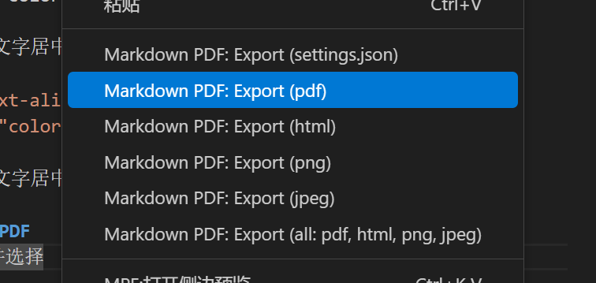
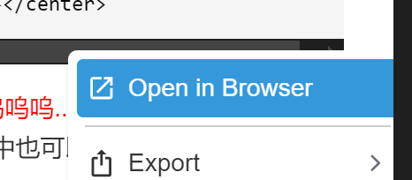

# Markdown-Learn
记录一下使用 VS Code 来学习 Markdown 的过程。
# <center>Markdown入门学习</center>
<center>Qilew       2024/11/11</center>

- [Markdown入门学习](#markdown入门学习)
  - [一、标题](#一标题)
  - [二、引用](#二引用)
  - [三、代码](#三代码)
    - [1.单行代码](#1单行代码)
    - [2.代码块](#2代码块)
  - [四、列表](#四列表)
    - [1.无序列表](#1无序列表)
    - [2.有序列表](#2有序列表)
    - [3.任务列表](#3任务列表)
  - [五、表格](#五表格)
  - [六、分割线](#六分割线)
  - [七、字体](#七字体)
    - [1.强调/粗体](#1强调粗体)
    - [2.斜体](#2斜体)
    - [3.强调并斜体](#3强调并斜体)
    - [4.高亮-就是变得黄黄的](#4高亮-就是变得黄黄的)
    - [5.删除线](#5删除线)
    - [6.上标](#6上标)
    - [6.下标](#6下标)
    - [7.下划线](#7下划线)
    - [8.注释/脚注](#8注释脚注)
  - [八、链接](#八链接)
  - [九、图片](#九图片)
  - [十、目录](#十目录)
  - [十一、数学公式](#十一数学公式)
  - [十二、内联HTML/CSS代码](#十二内联htmlcss代码)
  - [十三、导出为PDF](#十三导出为pdf)
- [其他的学了再来补！哈哈哈哈拜拜](#其他的学了再来补哈哈哈哈拜拜)

## 一、标题
```
书写格式：
    "#" + 空格 + 标题名字
# 一级标题
## 二级标题
### 三级标题
#### 四级标题
………………等等等等
```
## 二、引用
```
书写格式：
    ">" + 空格 + 内容
> 引用
>> 二级引用
```
看看效果：
> 这就是引用
> >这就是二级引用
## 三、代码
### 1.单行代码
```
书写格式：
    用 "`" 包围。
示例：
你吃不吃哥哥的`大肉棍`。
```
看看效果：
你吃不吃哥哥的`大肉棍`。
### 2.代码块
```
书写格式：
    用 "```" 包围。
示例：
#include <stdio.h>
int mian() {
    print(“Hello, world!\n");
    retrun O;
}
```
## 四、列表
### 1.无序列表
```
- 一个无序列表
+ 另一个无序列表
* 怎么还有无序列表
```
看看你的效果：
- 一个无序列表
+ 另一个无序列表
* 怎么还有无序列表
### 2.有序列表
```
1. 有序列表一号
2. 有序列表二号
3. 有序列表三号
    1. 哈被缩进了
注：按Tab可以实现缩进效果
```
看看效果：
1. 有序列表一号
2. 有序列表二号
3. 有序列表三号
   1. 哈哈被缩进了
### 3.任务列表
```
格式说明：
"-" + 空格 + "[ ]" + 空格 + 内容
    [ ]内加入"x"实现打钩
    你也可以手动在框里点一下
示例：
- [ ] 哈哈
- [ ] 小鼻嘎
- [x] 八嘎
```
看看效果：
- [ ] 哈哈
- [ ] 小鼻嘎
- [x] 八嘎
- [x] 如果你觉得本文不错的话你也可以点一下
## 五、表格
```
书写格式：
| 左对齐 | 居中对齐 | 右对齐 |
|:----|:----:|----:|
| a | b | c |
注:1.表格的前两行，第一行为标题，第二行为对齐方式，后面为内容。
   2.|:----|里的小横线随便几个都可以。一个也OK哒！
```
示例：
| 左对齐 | 居中对齐 | 右对齐 |
|:----|:----:|----:|
| a | b | c |

应用：

| 应用 | 账号 | 密码 |
|:----:|:----:|:----:|
|支付宝|my@qilew.eu.org|你以为我会告诉你吗|

## 六、分割线
```
书写格式：
    用3个或3个以上的 "*" 或 "-" 或 "_" 即可形成分割线。
示例：
***
---
___
```
看看效果：
***
---
___
## 七、字体
### 1.强调/粗体
```
书写格式：
    1.用 "**" 或 "__" 包围;
    2.选中想要强调的文字按下 Ctrl + B。
示例：
**你好牛逼！**
```
看看效果：
**你好牛逼！**
### 2.斜体
```
书写格式：
    1.用 "*" 或 "_" 包围;
    2.选中想要斜体的文字按下 Ctrl + I。
示例：
*谢谢！我不牛逼！我比较吊而已！*
```
看看效果：
*谢谢！我不牛逼！我比较吊而已！*
### 3.强调并斜体
```
书写格式：
    用 "***" 或 "___" 包围。
示例：
***感觉你有点火热！***
```
看看效果：
***感觉你有点火热！***
### 4.高亮-就是变得黄黄的
```
书写格式：
    用 "==" 包围。
示例：
==io小鬼说对了！==
```
看看效果：
==io小鬼说对了！==
### 5.删除线
```
书写格式：
    用 "~~" 包围。
示例：
~~宝宝你真棒！~~
```
看看效果：
~~宝宝你真棒！~~
### 6.上标
```
书写格式：
    用 "^" 包围。
示例：
    520^1314^
```
看看效果：
520^1314^
### 6.下标
```
书写格式：
    用 "~" 包围。
示例：
    H~2~O
```
看看效果：
H~2~O
### 7.下划线
```
书写格式：
    用 "<u>"和"</u>" 包围。
示例：
    <u>你敢不敢让我把话说完！</u>
```
看看效果：
<u>你敢不敢让我把话说完！</u>

### 8.注释/脚注
```
书写格式：
    在需要注释的地方注上[^1]、[^2]等，依此标注，并在文末附上解释。
示例：
你从丹东[^1]来，想吃广东菜[^2]。
[^1]:中国辽宁省丹东市。
[^2]:将军可能爱吃粤菜。
```
看看效果：
你从丹东[^1]来，想吃广东菜[^2]。
[^1]:中国辽宁省丹东市。
[^2]:将军可能爱吃粤菜。


## 八、链接
链接方式有多种，支持网页链接跳转, 按住 `Ctrl` 并 `单击鼠标左键` 即可跳转。
+ 直接放链接
```
就像这样：
https://github.com/QILEW/
```
效果如下：https://github.com/QILEW
+ 隐藏链接
```
书写格式：
    用 "[ ]" + "( )" 分别包围文本与链接。
示例：
[肘！跟俺进屋！](https://github.com/QILEW)
[不会啊](##八链接)
```
看看效果：[肘！跟俺进屋！](https://github.com/QILEW)你会不会搞`链接`啦？[不会啊](##八链接)
+ 利用注释，效果同上
```
书写格式：
    用 "[ ]" 分别包围显示文本与注释，注释放在文末处。
示例：
[嘤嘤嘤这是我家，你不许进来！][家的位置]
[家的位置]:https://github.com/QILEW
```
看看效果：[嘤嘤嘤这是我家，你不许进来！][家的位置]

[家的位置]:https://github.com/QILEW

## 九、图片
图片可以直接拖到编辑器里，在`VS Code`中按下`Shift`并拖拽进来。
```
书写格式：
    
示例：

```
看看效果：

## 十、目录
如果你和我一样使用`VS Code`来编辑`Markdown`，那么你可以在`设置`-`命令面板`中输入 `Create Table of Contents` 自动生成目录, 且可在扩展设置中细调目录参数，我还不会怎么调，学会了再来教你们。
## 十一、数学公式
`Markdown`中的数学公式主要是利用$\LaTeX$来搞的，如果你会用`MathType`的话也可以直接转化为$\LaTeX$公式。
```
书写格式：
    用"$"包围LaTeX公式。
示例：
    $f(x)=ax+b$
```
你来看看效果：
$f(x)=ax+b$
## 十二、内联HTML/CSS代码
这个东西很牛逼，但我还不会。
```
<div style="text-align:center">
  <font style="color:red">我不会 HTML 呜呜呜... 浇浇我</font>
</div>
<center>简单的文字居中也可以这样</center>
```
<div style="text-align:center">
  <font style="color:red">我不会 HTML 呜呜呜... 浇浇我</font>
</div>
<center>简单的文字居中也可以这样</center>

## 十三、导出为PDF
+ 在代码区右击并选择`Markdown PDF:Export(pdf)`
  
  但这样比较丑！
+ 在预览区右击并选择`Open in Browser`
  
  在浏览器中打开后再保存！嘎嘎好看!

# 其他的学了再来补！哈哈哈哈拜拜
